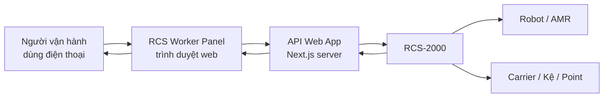
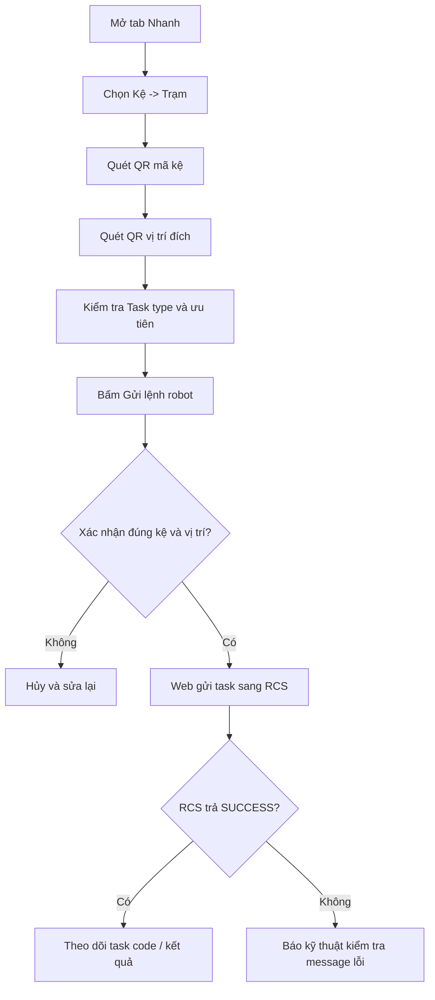
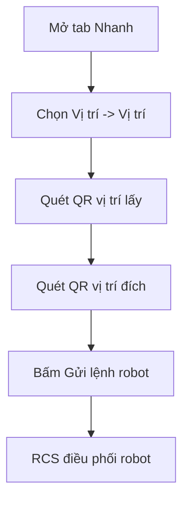
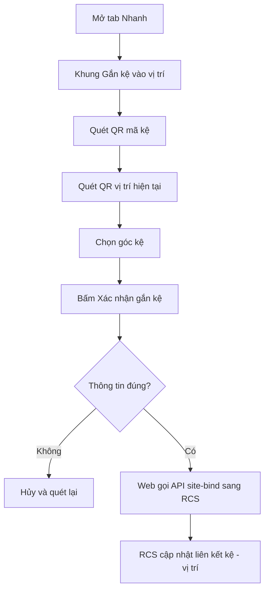
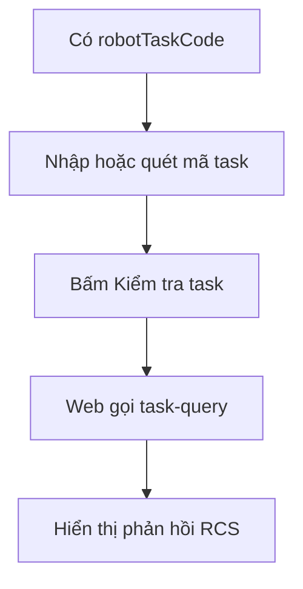
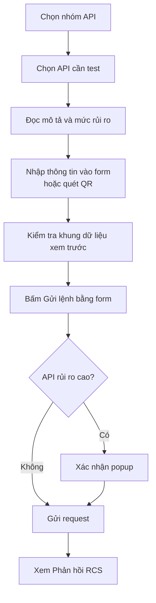
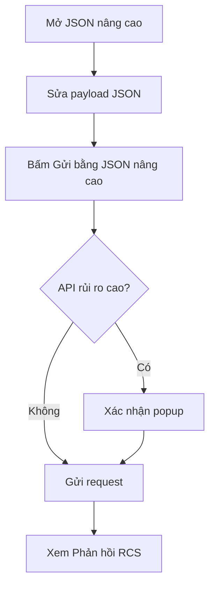

# Hướng Dẫn Sử Dụng RCS Worker Panel

Tài liệu này dành cho người vận hành tại nhà máy và người kỹ thuật hỗ trợ test hệ thống. Mục tiêu là giúp thao tác trên điện thoại rõ ràng, ít nhầm lẫn và biết phải làm gì khi có lỗi.

## 1. Hệ thống dùng để làm gì?

RCS Worker Panel là web app dùng trên máy tính hoặc điện thoại để:

- Quét QR mã kệ.
- Quét QR vị trí lấy hoặc vị trí đích.
- Gửi lệnh cho robot chạy task.
- Gắn kệ vào vị trí hiện tại trên hệ thống RCS.
- Kiểm tra trạng thái task, robot, carrier/kệ.
- Cho kỹ thuật viên test thêm các API RCS nâng cao.

## 2. Sơ đồ tổng quan



Diễn giải ngắn:

1. Người vận hành mở web trên điện thoại.
2. Web gửi yêu cầu về server đang chạy trong nhà máy.
3. Server ký request nếu có `APP_KEY` và `APP_SECRET`.
4. Server gọi API sang RCS.
5. RCS điều phối robot và trả kết quả về web.

## 3. Chuẩn bị trước khi dùng

Người kỹ thuật cần kiểm tra trước:

| Việc cần kiểm tra | Đạt khi |
|---|---|
| Máy chạy web cùng mạng với RCS | Ping hoặc truy cập được IP RCS |
| Điện thoại cùng Wi-Fi/LAN với máy chạy web | Mở được link web bằng IP máy chạy web |
| File `.env.local` đúng IP RCS | `RCS_HOST=https://IP_MAY_RCS` |
| Nếu RCS dùng ký số | Đã điền `APP_KEY` và `APP_SECRET` |
| QR trên kệ/vị trí đọc được | Bấm nút quét QR và app tự điền mã |

Ví dụ `.env.local`:

```env
RCS_HOST=https://192.168.50.9
APP_KEY=
APP_SECRET=
```

Lưu ý: `RCS_HOST` phải có đủ `https://` hoặc `http://`. Không để thiếu chữ `h` như `ttps://...`.

## 4. Cách mở web

### Trên máy tính chạy web

```text
http://localhost:3000
```

### Trên điện thoại cùng mạng

Nếu chỉ xem giao diện:

```text
http://IP_MAY_CHAY_WEB:3000
```

Nếu cần dùng camera quét QR, nên mở bằng HTTPS:

```text
https://IP_MAY_CHAY_WEB:3000
```

Ví dụ:

```text
https://192.168.0.156:3000
```

Nếu trình duyệt báo cảnh báo chứng chỉ bảo mật, chọn tiếp tục truy cập. Đây là chứng chỉ tự ký khi chạy dev server.

## 5. Màn hình chính

Thanh menu phía trên có các nhóm:

| Mục | Dành cho | Công dụng |
|---|---|---|
| `Nhanh` | Công nhân vận hành | Chạy robot, gắn kệ, kiểm tra task nhanh |
| `Task workflow` | Kỹ thuật / vận hành nâng cao | Tạo task, tiếp tục task, hủy task, đổi ưu tiên |
| `Kệ, carrier, point` | Kỹ thuật / vận hành nâng cao | Bind/unbind, khóa/mở khóa carrier và point |
| `Khu vực` | Kỹ thuật / trưởng ca | Dừng vùng, mở vùng, clear area, homing |
| `Trạng thái` | Vận hành / kỹ thuật | Query task, robot, carrier |
| `Tích hợp và callback` | Kỹ thuật hệ thống | Xem endpoint RCS gọi ngược về web |

Người vận hành thông thường nên dùng mục `Nhanh`.

## 6. Luồng 1: Chạy robot chuyển kệ đến trạm

Sử dụng khi đã biết mã kệ và vị trí đích.



Các bước thao tác:

1. Mở web trên điện thoại.
2. Vào tab `Nhanh`.
3. Chọn chế độ `Kệ -> Trạm`.
4. Bấm nút QR ở ô `Mã kệ`, quét QR trên kệ.
5. Bấm nút QR ở ô `Vị trí đích`, quét QR tại trạm/điểm đích.
6. Kiểm tra:
   - `Task type`: thường là `PF-LMR-COMMON`.
   - `Ưu tiên`: mặc định `10`.
   - `Loại kệ`: theo cấu hình nhà máy.
7. Bấm `Gửi lệnh robot`.
8. Đọc popup xác nhận. Nếu đúng thì bấm OK.
9. Xem kết quả ở khung `Phản hồi RCS`.

## 7. Luồng 2: Chạy robot từ vị trí này sang vị trí khác

Sử dụng khi muốn robot lấy ở một vị trí và đưa sang vị trí khác.



Các bước thao tác:

1. Vào tab `Nhanh`.
2. Chọn `Vị trí -> Vị trí`.
3. Quét `Vị trí lấy`.
4. Quét `Vị trí đích`.
5. Kiểm tra `Task type`, thường là `PF-DETECT-CARRIER`.
6. Bấm `Gửi lệnh robot`.
7. Xem kết quả trả về.

## 8. Luồng 3: Gắn kệ vào vị trí hiện tại

Sử dụng khi kệ bị kéo bằng tay, cần cập nhật lại vị trí kệ trên RCS.



Các bước thao tác:

1. Vào tab `Nhanh`.
2. Tìm khung `Gắn kệ vào vị trí`.
3. Quét QR `Mã kệ`.
4. Quét QR `Vị trí hiện tại`.
5. Chọn `Góc kệ`: `0`, `90`, `180`, `-90`, hoặc `360`.
6. Bấm `Xác nhận gắn kệ`.
7. Đọc popup xác nhận. Nếu đúng thì bấm OK.
8. Xem kết quả ở `Phản hồi RCS`.

Khi không chắc góc kệ, không nên xác nhận. Hãy hỏi kỹ thuật hoặc trưởng ca.

## 9. Luồng 4: Kiểm tra trạng thái task

Sử dụng khi cần biết task đang chờ, đang chạy, đã xong hay lỗi.



Các bước thao tác:

1. Vào tab `Nhanh`.
2. Ở khung `Tra cứu nhanh`, nhập hoặc quét `Mã task`.
3. Bấm `Kiểm tra task`.
4. Xem phản hồi:
   - `SUCCESS`: RCS trả dữ liệu task.
   - `Err_TaskCodeNotFound`: không tìm thấy task.
   - Các lỗi khác: báo kỹ thuật.

## 10. Cách đọc kết quả phản hồi RCS

Khung `Phản hồi RCS` hiển thị JSON trả về.

Các trường thường gặp:

| Trường | Ý nghĩa |
|---|---|
| `code` | Mã kết quả nghiệp vụ của RCS |
| `message` | Nội dung mô tả |
| `data.robotTaskCode` | Mã task do RCS trả về |
| `taskStatus` | Trạng thái task |
| `singleRobotCode` | Mã robot đang thực hiện |
| `carrierCode` | Mã kệ/carrier |
| `siteCode` | Mã vị trí/point |

Một số `code` thường gặp:

| Code | Ý nghĩa |
|---|---|
| `SUCCESS` | Thành công |
| `Err_TaskNotFound` | Không tìm thấy task |
| `Err_TargetRouteError` | Sai route hoặc mã điểm/kệ |
| `Err_TaskFinished` | Task đã kết thúc |
| `Err_Bound` | Carrier đã được gắn với object khác |
| `Err_TaskFound` | Carrier đang có task, không thể bind/unbind |

## 11. Quy tắc an toàn khi vận hành

Trước khi bấm gửi lệnh:

- Kiểm tra đúng mã kệ.
- Kiểm tra đúng vị trí đích.
- Không gửi nhiều lần liên tiếp nếu chưa biết task trước đã thành công hay lỗi.
- Không dùng các API `Khu vực` nếu không được phân quyền.
- Không dùng `Cancel Task`, `LOCK`, `FREEZE`, `BANISH`, `BLOCKADE` nếu không hiểu tác động.

Các API có mức `Cần xác nhận` có thể ảnh hưởng trực tiếp đến robot, khu vực hoặc task đang chạy.

## 12. Dành cho kỹ thuật: API Console

API Console nằm ở các tab ngoài `Nhanh`.

Mỗi API có:

- Tên API.
- Endpoint RCS.
- Mô tả ngắn.
- Mức rủi ro.
- Các ô nhập liệu rõ ràng.
- Dropdown cho các lựa chọn cố định như `LOCK/UNLOCK`, `FREEZE/RUN`, `BIND/UNBIND`.
- Nút quét QR cho các mã như mã kệ, mã vị trí, mã task, mã robot, mã khu vực.
- Khung xem trước dữ liệu sẽ gửi sang RCS.
- Phần `JSON nâng cao` dành riêng cho kỹ thuật khi cần debug.

Luồng dùng API Console:



Luồng JSON nâng cao chỉ dành cho kỹ thuật:



### Nhóm Task workflow

| API | Khi dùng |
|---|---|
| `Task Group` | Khi nhiều task cần chạy theo nhóm/thứ tự |
| `Apply Task` | Tạo task robot |
| `Continue Task` | Cho task nhiều bước chạy tiếp |
| `Cancel Task` | Hủy task |
| `Set Task Priority` | Đổi ưu tiên task |
| `Apply Pre-Scheduling Task` | Gọi robot tới trước |
| `General Custom API` | Scene tùy chỉnh theo RCS/WCS |

### Nhóm Kệ, carrier, point

| API | Khi dùng |
|---|---|
| `Link Carrier to Point` | Gắn carrier vào point |
| `Unlink Carrier from Point` | Bỏ gắn carrier khỏi point |
| `Link/Unlink Storage Object to Carrier` | Gắn/bỏ gắn storage object với carrier |
| `Enable/Disable Carrier` | Khóa/mở khóa kệ |
| `Enable/Disable Point` | Khóa/mở khóa điểm |

### Nhóm Khu vực

| API | Khi dùng |
|---|---|
| `Pause/Restore AMRs in Area` | Dừng hoặc cho robot trong vùng chạy lại |
| `Return AMR to Fixed Area` | Gọi robot về khu vực cố định |
| `Clear Area` | Đưa robot ra khỏi vùng |
| `Block/Release Area` | Chặn hoặc mở vùng |

### Nhóm Trạng thái

| API | Khi dùng |
|---|---|
| `Search Task Status` | Xem task |
| `Search AMR Status` | Xem robot |
| `Search Carrier Status` | Xem kệ/carrier |

### Nhóm Tích hợp và callback

| API | Ý nghĩa |
|---|---|
| `Notify Third-Party Device Execution` | Web/WCS báo RCS rằng thiết bị bên thứ ba đã xong |
| `Receive Task Performance Feedback` | RCS báo tiến độ task về web |
| `Receive Resource Request from RCS` | RCS xin tài nguyên từ WMS/web |
| `Receive Third-Party Device Request` | RCS yêu cầu WCS điều khiển thiết bị |
| `Receive AMR Returning Feedback` | RCS báo robot đã về khu vực cố định |
| `Receive Area Clearing Feedback` | RCS báo clear area hoàn tất |
| `Receive AMR Exception Alarm` | RCS báo alarm robot |
| `Receive Task Exception Alarm` | RCS báo alarm task |

Callback hiện tại trả `SUCCESS` mặc định và log payload ra server. Nếu cần xử lý nghiệp vụ thật, kỹ thuật phải bổ sung logic riêng.

## 13. Định dạng QR nên dùng

QR có thể là text đơn giản:

```text
RACK_01
```

Hoặc JSON:

```json
{
  "carrierCode": "RACK_01"
}
```

Hoặc URL:

```text
https://factory.local/qr?siteCode=STATION_A
```

App sẽ tự tìm các field:

```text
carrierCode, siteCode, robotTaskCode, singleRobotCode, zoneCode, code, id, value, text
```

Khuyến nghị QR trong nhà máy:

| Loại QR | Field nên dùng |
|---|---|
| QR trên kệ | `carrierCode` |
| QR tại vị trí/trạm | `siteCode` hoặc `code` |
| QR task | `robotTaskCode` |
| QR robot | `singleRobotCode` |
| QR khu vực | `zoneCode` |

## 14. Lỗi thường gặp và cách xử lý

| Hiện tượng | Nguyên nhân thường gặp | Cách xử lý |
|---|---|---|
| Không mở được web trên điện thoại | Sai IP máy chạy web hoặc không cùng mạng | Kiểm tra Wi-Fi/LAN và IP |
| Camera không mở | Dùng HTTP trên điện thoại | Chạy `npm run dev:https` và mở bằng HTTPS |
| RCS trả lỗi kết nối | Máy web không thấy IP RCS | Kiểm tra `RCS_HOST`, firewall, mạng |
| RCS trả `Err_TargetRouteError` | Sai mã kệ/vị trí hoặc route không hợp lệ | Kiểm tra QR và cấu hình point trên RCS |
| Bind kệ thất bại | Kệ đang có task hoặc đã bind object khác | Query carrier, hủy task nếu cần, rồi thử lại |
| Task không tìm thấy | Nhập sai `robotTaskCode` | Quét lại mã task hoặc lấy từ phản hồi tạo task |

## 15. Checklist thao tác nhanh cho công nhân

Trước khi gửi lệnh:

```text
[ ] Đúng mã kệ
[ ] Đúng vị trí lấy hoặc vị trí đích
[ ] Không có người/vật cản ở khu vực nguy hiểm
[ ] Đã đọc popup xác nhận
[ ] Sau khi gửi, đã xem phản hồi RCS
```

Khi có lỗi:

```text
1. Chụp màn hình phản hồi RCS.
2. Ghi lại mã kệ, mã vị trí, mã task.
3. Báo kỹ thuật hoặc trưởng ca.
4. Không bấm gửi lại nhiều lần nếu chưa rõ nguyên nhân.
```
